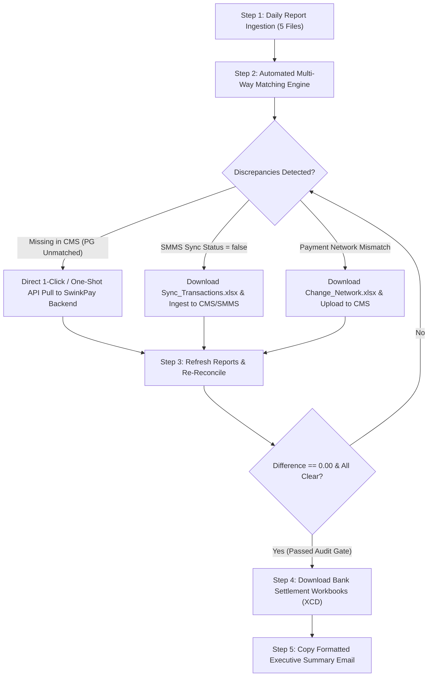
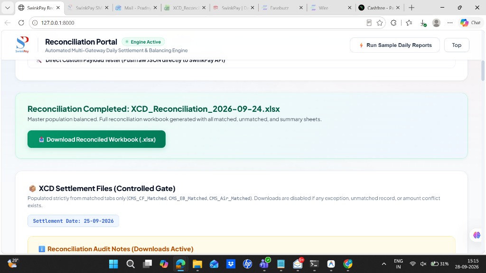
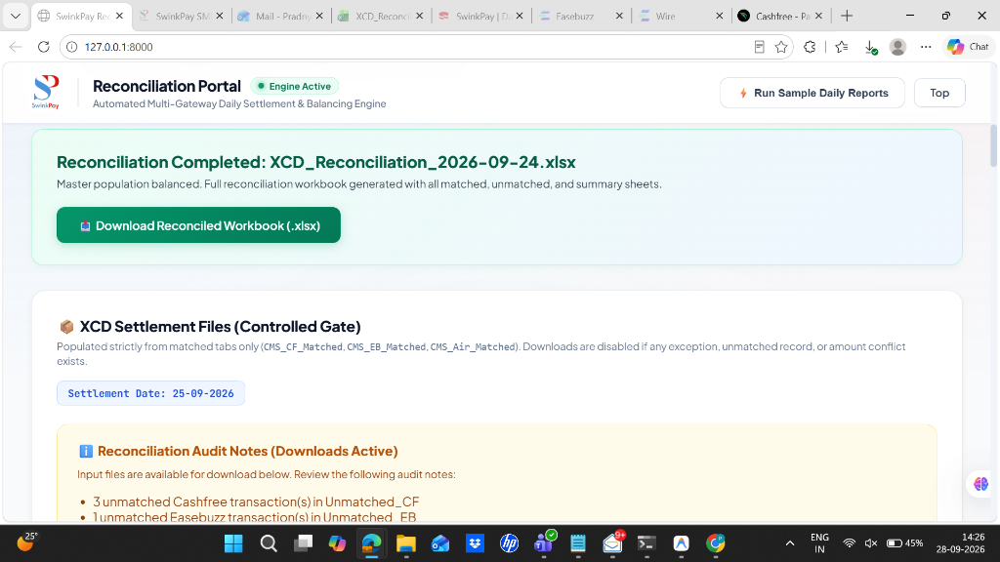
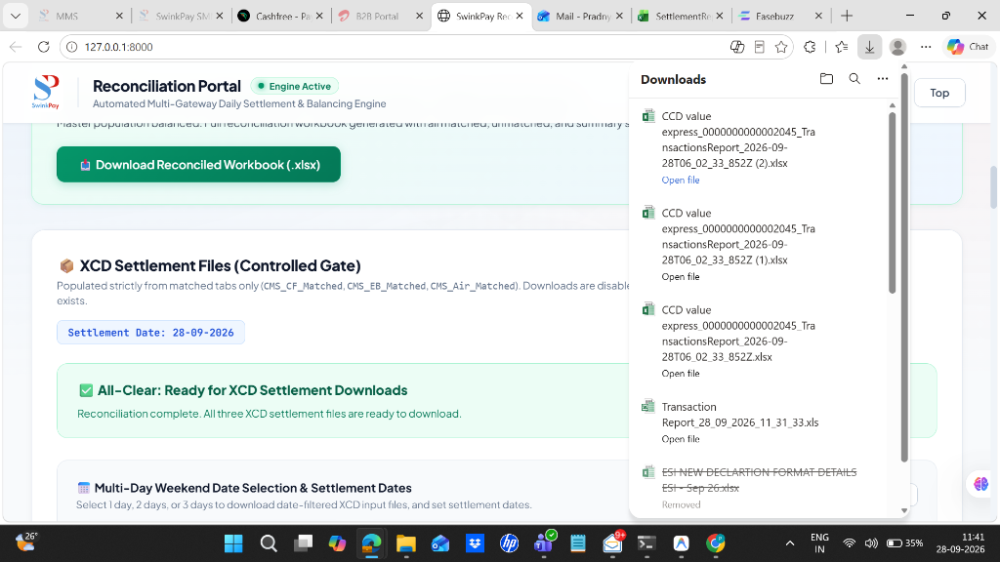
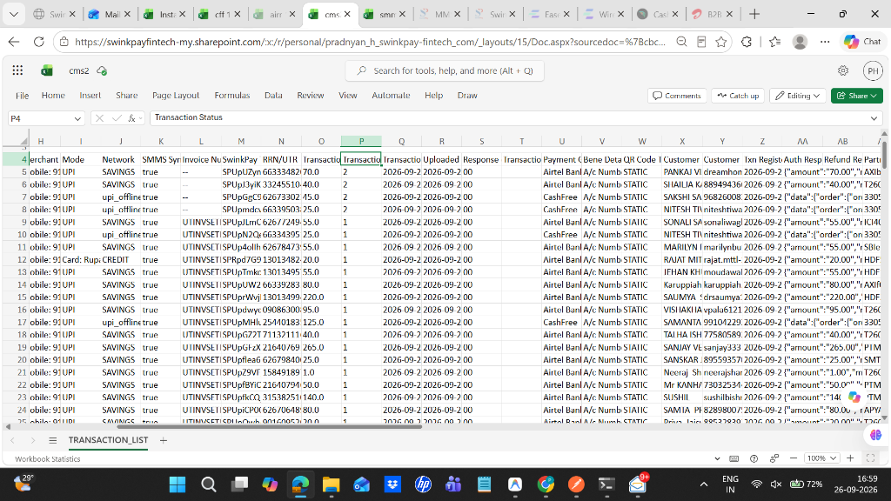
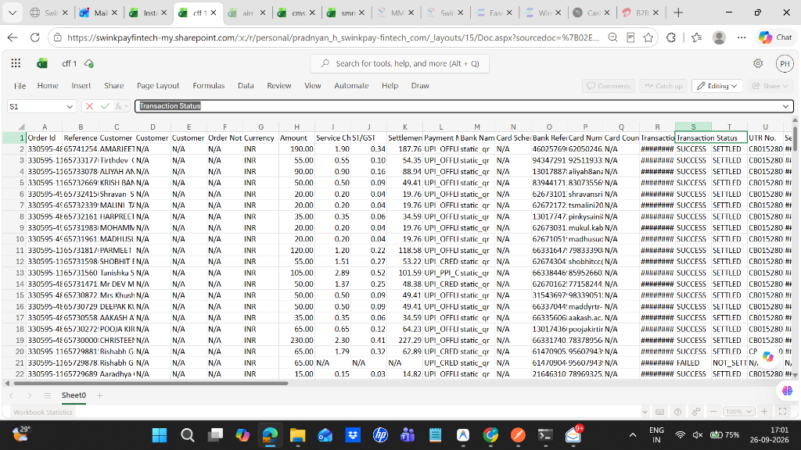

# Ops_Auto — Automated FinOps Payment Reconciliation & Settlement Engine

[](https://www.python.org/)
[](https://fastapi.tiangolo.com/)
[](https://openpyxl.readthedocs.io/)
[](https://www.uvicorn.org/)
[](LICENSE)
[](tests/)

An enterprise-grade, high-throughput financial transaction reconciliation and bank settlement automation platform. Designed for fintech operations teams, **Ops_Auto** replaces error-prone manual spreadsheet workflows with deterministic multi-way matching, automated missing transaction recovery via Payment Gateway REST APIs (eliminating manual Postman calls), strict difference-to-zero audit validation, and bank-ready settlement (XCD) file generation.

---

## 📑 Table of Contents
1. [Problem](#1-problem)
2. [Architecture](#2-architecture)
3. [Technologies](#3-technologies)
4. [How It Works](#4-how-it-works)
5. [API Endpoints](#5-api-endpoints)
6. [Database & Storage](#6-database--storage)
7. [Sample Input](#7-sample-input)
8. [Sample Output](#8-sample-output)
9. [Screenshots](#9-screenshots)
10. [How to Run](#10-how-to-run)
11. [Future Improvements](#11-future-improvements)

---

## 1. Problem

Modern digital payment operations require reconciling transactions across disparate systems: Core Merchant Systems (**CMS**), Smart Merchant Management Systems (**SMMS**), and multiple Payment Gateways (**Cashfree**, **Easebuzz**, **Airtel Payments Bank**). Managing this manually at high transaction volumes presents severe operational and financial risks:

* **Fragmented Data Silos & Schema Chaos**: Each gateway and internal platform exports reports in conflicting formats (`.xlsx`, `.xls`, `.csv`), different timestamp representations, and non-standardized column headers.
* **Hours of Manual VLOOKUPs**: Operations analysts previously spent **3 to 5 hours every morning** manually joining spreadsheets with 50,000+ rows. Human error in formulas led to silent data drops and calculation discrepancies.
* **The "Missing CMS Transaction" Nightmare**: When a customer completes payment at a gateway but a network timeout or dropped webhook prevents the record from posting into CMS, the transaction is dropped from merchant records. Historically, operators had to manually identify these records, look up merchant Terminal IDs, configure Postman with API tokens, and push them one-by-one into the Decision API.
* **Status Inconsistencies & False Successes**: A Payment Gateway might record a transaction as `Success`, while CMS or SMMS records it as `Failed` or `Pending`. Without deterministic cross-status comparison, merchants risk payout disputes or uncredited customer funds.
* **Data Corruption in Bank UTRs & RRNs**: Spreadsheet software frequently converts 12-digit bank Reference Numbers (UTR/RRN) into scientific notation (e.g., `6.78988E+11`) or strips leading zeros (e.g., `6789876543` instead of the 12-digit standard `006789876543`), causing API pull rejections.
* **Payment Network Misclassifications**: Inaccurate payment interchange tagging (e.g., RuPay Credit Card on UPI incorrectly tagged as standard `RUPAY` or Wallets tagged as `WA` instead of interchange-standard codes) requires manual extraction of delta files for CMS updates.
* **Financial Leakage & Settlement Imbalance**: Releasing bank settlement files without mathematical proof that $\text{Gross Amount} - \text{Charges} - \text{GST} = \text{Net Credit}$ risks direct financial loss.

---

## 2. Architecture

Ops_Auto utilizes a modular pipeline architecture separating ingestion, normalization, multi-way matching, audit balancing, API synchronization, and reporting.

```
+----------------------------------------------------------------------------------------------------+
|                                    INGESTION & DATA ADAPTATION                                     |
|  [CMS Report (.xlsx/.xls)]  [SMMS Report (.xlsx)]  [Cashfree (.xlsx)]  [Easebuzz (.csv)]  [Airtel] |
+----------------------------------------------------------------------------------------------------+
                                                  │
                                                  ▼
+----------------------------------------------------------------------------------------------------+
|                          DYNAMIC HEADER-SIGNATURE DETECTION & NORMALIZATION                        |
|  • Signature-based fingerprinting (zero filename reliance; detects report type by column schema)    |
|  • Universal 12-digit UTR/RRN zero-padding sanitizer (e.g. 6789876543 ──► 006789876543)             |
|  • Exact float sanitization for amounts, currency strings, and timestamps                          |
+----------------------------------------------------------------------------------------------------+
                                                  │
                                                  ▼
+----------------------------------------------------------------------------------------------------+
|                                DETERMINISTIC MULTI-WAY MATCHING ENGINE                             |
|  • CMS <──> SMMS Matching (SwinkPay Txn ID & Bank RRN)                                             |
|  • CMS <──> Cashfree Matching (Bank Reference No / Order ID)                                       |
|  • CMS <──> Easebuzz Matching (Bank UTR / Ref No)                                                  |
|  • CMS <──> Airtel Matching (Partner Ref ID / Bank UTR)                                            |
|  • Secondary Airtel Settlement Verification (Net Amount & UTR confirmation)                        |
+----------------------------------------------------------------------------------------------------+
                                                  │
                        ┌─────────────────────────┴─────────────────────────┐
                        ▼                                                   ▼
+-----------------------------------------------+   +------------------------------------------------+
|             MATCHED TRANSACTIONS              |   |              DISCREPANCY ISOLATION             |
|  • CMS_SMMS_Matched       • CMS_CF_Matched    |   |  1. Missing in CMS (PG Unmatched)              |
|  • CMS_EB_Matched         • CMS_Air_Matched   |   |  2. Status Conflicts (PG Success vs CMS Fail)  |
|  • Multi-Day Weekend Date Partitioning        |   |  3. Un-synced SMMS (Sync Status = false)       |
|    (Fri / Sat / Sun Checkbox Filtering)       |   |  4. Network Misclassifications (RuPay CC / WA) |
+-----------------------------------------------+   +------------------------------------------------+
                        │                                                   │
                        ▼                                                   ▼
+-----------------------------------------------+   +------------------------------------------------+
|       STRICT AUDIT GATE (|Diff| == 0.00)      |   |          AUTOMATED ACTION ARTIFACTS            |
|  Gross - Charges - GST - Net Credit == 0.00   |   |  • Sync_Transactions_YYYY-MM-DD.xlsx (SMMS)    |
|  Locks settlement download if non-zero        |   |  • Change_Network_YYYY-MM-DD.xlsx (CMS)        |
+-----------------------------------------------+   +------------------------------------------------+
                        │                                                   │
                        ▼                                                   ▼
+-----------------------------------------------+   +------------------------------------------------+
|          BANK SETTLEMENT WORKBOOKS (XCD)      |   |       DECISION API 1-SHOT RECOVERY ENGINE      |
|  • XCD Input file as on YYYY-MM-DD (Cashfree) |   |  • Multi-Merchant Terminal Context Resolver    |
|  • XCD Input file as on YYYY-MM-DD (Easebuzz) |   |  • Standalone Full PG Report Upload & Push     |
|  • XCD Input file as on YYYY-MM-DD (Airtel)   |   |  • Live Postman Telemetry Inspector (200 OK)   |
|  • Executive Settlement Email Summary         |   |    https://merchants.swinkpay-fintech.com/     |
+-----------------------------------------------+   +------------------------------------------------+
```

### Complete End-to-End Operational Lifecycle



---

## 3. Technologies

| Category | Technology | Usage in Ops_Auto |
| :--- | :--- | :--- |
| **Backend Framework** | **Python 3.12+** | Core runtime for asynchronous execution and file streaming. |
| **API Server** | **FastAPI (v0.110+)** | High-performance ASGI REST API framework with native data validation and Swagger/OpenAPI docs. |
| **ASGI Web Server** | **Uvicorn** | Production-ready asynchronous server with auto-reload and worker management. |
| **Spreadsheet Engine** | **openpyxl (v3.1+)** | High-speed read/write for 18-sheet reconciliation workbooks, cell styling, formulas, and auto-width calculation. |
| **Data Normalization** | **Regular Expressions (`re`)** | Pattern-based extraction of terminal tokens from Order IDs and UTR formatting. |
| **Memory Optimization** | **In-Memory Hash Indexing** | $O(1)$ dictionary lookups indexing transactions by RRN, UTR, and Order ID for sub-second reconciliation across 100,000+ records. |
| **Frontend Architecture** | **Vanilla JavaScript (ES6+)** | Zero-dependency, ultra-fast client-side application using asynchronous `fetch`, DOM manipulation, and event handling. |
| **Styling & Design System**| **CSS3 Glassmorphism** | Custom FinOps design system with CSS custom properties, backdrop blur, flex/grid layouts, and responsive panels. |
| **Test Suite** | **Python `unittest`** | 58 unit and integration tests verifying matching accuracy, audit balancing, edge-case date filtering, and API contracts. |

---

## 4. How It Works

### Step 1: Dynamic Header-Signature Auto-Detection
Files are dragged and dropped into the web dashboard or submitted via API. The engine scans the first non-empty header row and matches it against distinctive column signatures. **File names are completely ignored**:
* **CMS**: Detects `SwinkPay Txn ID`, `Order ID`, `Bank Ref No`, `Terminal ID`, `Network`.
* **SMMS**: Detects `SwinkPay Txn ID`, `RRN`, `Sync Status`, `Txn Amount`.
* **Cashfree**: Detects `Order Id`, `Bank Reference No`, `Service Tax`, `Settlement Amount`.
* **Easebuzz**: Detects `Easebuzz ID`, `Order ID`, `Payment Status`, `Payment Source`.
* **Airtel**: Detects `Partner Ref ID`, `Bank Reference No`, `Fee`, `GST`.

### Step 2: Deterministic Data Normalization
* **12-Digit UTR Zero-Padding**: Bank UTRs missing leading zeros (e.g., `6789876543`) or converted into numbers are sanitized into standardized 12-digit strings (`006789876543`).
* **Amount Cleaning**: Strips currency symbols (`₹`, `$`, commas) and parses values into high-precision floats.
* **Timestamp Harmonization**: Standardizes disparate gateway datetime representations into uniform ISO format (`YYYY-MM-DD HH:MM:SS`).

### Step 3: Multi-Way In-Memory Matching
The engine builds in-memory hash indices on unique reconciliation keys:
1. Matches **CMS** records against **SMMS** using `SwinkPay Txn ID` and `RRN`.
2. Matches **CMS** against **Cashfree** using `Bank Reference No` (UTR) and `Order ID`.
3. Matches **CMS** against **Easebuzz** using `Bank Ref No` (UTR).
4. Matches **CMS** against **Airtel** using `Partner Ref ID` and `Bank Reference No`.
5. Verifies **Airtel Settlement** files against the transaction report on `Net Amount` and `UTR`.

### Step 4: Discrepancy Quarantine & Automated Action Files
* **Missing in CMS**: Records that exist in Payment Gateway reports but are completely missing from CMS are segregated for immediate 1-click or batch API recovery.
* **Status Conflicts Table**: Flags records where the Payment Gateway reports `Success`, but CMS or SMMS marks the payment as `Failed` or `Pending`.
* **SMMS Sync Workbook (`Sync_Transactions_YYYY-MM-DD.xlsx`)**: Isolates transactions where `SMMS Sync Status = false` for bulk upload into the CMS/SMMS admin portal.
* **Network Change Workbook (`Change_Network_YYYY-MM-DD.xlsx`)**: Evaluates payment network codes against semantic equivalence rules:
  * `UPI` vs `UPI_OFFLINE_STATIC` $\rightarrow$ **Equivalent** (Standard Static QR; no change needed).
  * `RUPAY` vs `UPI_CREDIT_CARD_OFFLINE_STATIC` $\rightarrow$ **Genuine Misclassification** (Routed to change file).
  * `WA` vs `UPI_PPI_OFFLINE_STATIC` $\rightarrow$ **Genuine Misclassification** (Routed to change file).

### Step 5: Strict Difference-to-Zero Audit Control
Before any bank settlement file can be generated or downloaded, the system enforces the financial balance audit equation across each gateway:
$$\text{Difference} = \text{Gross Amount} - \text{PSP Charges} - \text{GST} - \text{Net Credit Amount}$$
* If $|\text{Difference}| == 0.00$, the system issues the **ALL CLEAR** badge and unlocks the settlement files.
* If $|\text{Difference}| > 0.00$, downloads are blocked, and an audit warning surfaces detailing the exact discrepancy.

### Step 6: Automated Missing Transaction Recovery (Eliminating Postman)
The **Pull Missing Transactions** tab enables instant one-shot ingestion to the SwinkPay Decision API (`https://merchants.swinkpay-fintech.com/api/v2/decision/updated`):
1. **Terminal Mapping Context**: Resolves Terminal IDs and Store Names using merchant mapping files (`TID_FILE`). For Cashfree, it dynamically parses middle tokens from Order IDs (e.g., `330595-4860-...` $\rightarrow$ `4860`).
2. **Direct PG Report Ingestion**: Operators can drop any full gateway report (Easebuzz, Cashfree, Airtel, or CSV) to parse and pull hundreds of transactions in 1 shot.
3. **Live Telemetry Inspector**: Emulates Postman output directly inside the dashboard, displaying HTTP status codes (`200 OK`), round-trip latency (`ms`), SwinkPay Transaction IDs, and formatted response JSON.

### Step 7: Multi-Day Weekend Date Filtering & Executive Reporting
* **Weekend Breakdown**: For multi-day weekend reconciliation batches, operators can check/uncheck individual dates (Friday, Saturday, Sunday) to calculate and download distinct daily bank settlement files.
* **Executive Email Drafter**: Automatically compiles transaction totals, active outlet counts, fee deductions, and net payouts into a formatted email ready to send to leadership and finance.

---

## 5. API Endpoints

Ops_Auto provides a full REST API for programmatic execution, cron automation, or headless microservice integration:

| Method | Endpoint | Description | Request Payload | Response |
| :--- | :--- | :--- | :--- | :--- |
| `GET` | `/` | Serves the web dashboard SPA | None | HTML |
| `POST` | `/api/reconcile` | Executes full 5-file reconciliation pipeline | `multipart/form-data` (`files`: 5 daily reports) | Full JSON audit statistics, summary cards, and session ID |
| `POST` | `/api/sample-reconcile` | Runs reconciliation on bundled test datasets | None | Full JSON audit statistics |
| `POST` | `/api/detect-files` | Pre-flight inspection; identifies uploaded file types | `multipart/form-data` (`files`) | JSON mapping of detected file types and row counts |
| `POST` | `/api/upload-recon-file` | Instant parse of an existing reconciliation workbook | `multipart/form-data` (`file`: `.xlsx`) | Extracted discrepancies, dates, missing transactions |
| `GET` | `/api/download/{session_id}` | Downloads 18-sheet master reconciliation workbook | Path parameter: `session_id` | Excel file (`.xlsx`) |
| `GET` | `/api/download-sync-file/{session_id}` | Downloads SMMS sync workbook | Path parameter: `session_id` | Excel file (`Sync_Transactions_*.xlsx`) |
| `GET` | `/api/download-network-file/{session_id}` | Downloads CMS network change workbook | Path parameter: `session_id` | Excel file (`Change_Network_*.xlsx`) |
| `GET` | `/api/download-xcd/{session_id}/{partner}` | Downloads partner settlement workbook | Path: `session_id`, `partner` (`cf`, `eb`, `airtel`)<br>Query: `?dates=YYYY-MM-DD` | Excel file (`XCD Input file...xlsx`) |
| `POST` | `/api/generate-xcd/{session_id}` | Generates date-filtered settlement files | JSON: `{ "dates": ["2026-09-24"] }` | Filtered counts and settlement totals |
| `POST` | `/api/pull-missing-pg/{session_id}` | Pulls missing reconciliation records to Decision API | JSON: `{ "index": 0, "auth_token": "...", "channel": "14" }` or `{ "pull_all": true }` | API response, HTTP status, live telemetry |
| `POST` | `/api/direct-pull/upload` | Parses standalone full PG report for one-shot pull | `multipart/form-data` (`file`, `merchant_key`) | Parsed transaction rows with resolved Terminal IDs |
| `POST` | `/api/direct-pull/push` | Executes one-shot pull for direct PG report rows | JSON: `{ "records": [...], "auth_token": "...", "channel": "14" }` | Batch pull execution telemetry & counts |
| `GET` | `/api/merchants` | Lists all registered merchant profiles | None | JSON array of merchant profiles and terminal counts |
| `POST` | `/api/merchants` | Registers or updates a merchant profile | JSON: `{ "key": "...", "display_name": "..." }` | Merchant configuration object |
| `DELETE`| `/api/merchants/{key}` | Deletes a custom merchant profile | Path parameter: `key` | Deletion confirmation |
| `POST` | `/api/upload-terminal-file` | Uploads merchant terminal mapping master file | `multipart/form-data` (`file`: `TID_FILE.xlsx`, `merchant_key`) | Loaded terminal mapping count and sample rows |
| `GET` | `/api/terminal-mappings-status` | Checks active terminal mappings status | Query: `?merchant_key=...` | Active mappings count and file timestamp |
| `GET` | `/api/resolve-terminal` | Resolves terminal context by TID or middle number | Query: `?q=4860&merchant_key=...` | Resolved Terminal ID, Store Name, MMS TID |
| `GET` | `/api/terminal-mappings` | Returns all terminal mapping records | Query: `?merchant_key=...` | Paginated terminal mappings |
| `DELETE`| `/api/terminal-mappings` | Clears terminal mappings for a merchant | Query: `?merchant_key=...` | Reset confirmation |
| `GET` | `/api/settings` | Retrieves persistent API connection credentials | None | JSON: `{ "auth_token": "...", "channel": "14", "endpoint": "..." }` |
| `POST` | `/api/settings` | Persists API credentials permanently | JSON: `{ "auth_token": "...", "channel": "14" }` | Success status |

---

## 6. Database & Storage

To guarantee maximum speed and portability across bank on-premise environments, cloud containers, and local operator workstations, Ops_Auto utilizes an **optimized hybrid storage model** combining in-memory hash tables with a structured file-system session store:

```text
Ops_Auto/
├── dashboard_sessions/           # Isolated Session Storage (UUID partitioned)
│   └── <session_id>/
│       ├── raw_uploads/          # Original ingested files (CMS, SMMS, Cashfree, Easebuzz, Airtel)
│       ├── session_meta.json     # Full audit metadata, status counts, dates, active outlets
│       ├── XCD_Reconciliation_*.xlsx      # 18-sheet master reconciliation workbook
│       ├── Sync_Transactions_*.xlsx       # SMMS sync workbook
│       ├── Change_Network_*.xlsx          # CMS network change workbook
│       └── XCD Input file as on *.xlsx    # Bank settlement files (Cashfree, Easebuzz, Airtel)
├── data/
│   ├── settings.json             # Persistent API credentials (auth token, channel, target URL)
│   └── merchants/                # Merchant Terminal Directories
│       ├── default/
│       │   ├── meta.json         # Merchant profile metadata
│       │   └── terminals.xlsx    # Persisted Terminal Mapping master file (TID_FILE)
│       └── <custom_merchant>/
│           ├── meta.json
│           └── terminals.xlsx
```

### Storage Characteristics
* **Zero External DB Dependencies**: No requirement for PostgreSQL, MySQL, or MongoDB installations. Zero connection pool bottlenecks or schema migration overhead.
* **$O(1)$ In-Memory Indexing**: Active reconciliations build transient dictionary indices on normalized keys (`UTR`, `RRN`, `Order ID`), executing joins in milliseconds.
* **Session Isolation & Audit Trail**: Every reconciliation run creates an isolated directory keyed by UUID, storing the raw source files, audit metadata JSON, and all generated Excel artifacts for historical verification.

---

## 7. Sample Input

### 1. CMS Transaction Report (`CMS_Report_YYYY-MM-DD.xlsx`)
| SwinkPay Txn ID | Order ID | Bank Ref No | Txn Date | Amount | Status | Network | Terminal ID |
| :--- | :--- | :--- | :--- | :--- | :--- | :--- | :--- |
| `SWP1098234` | `330595-4860-AXI9823` | `426801928374` | `2026-09-24 10:14:22` | `450.00` | `SUCCESS` | `UPI_OFFLINE_STATIC` | `141001117` |
| `SWP1098235` | `330595-4860-AXI9824` | `426801928375` | `2026-09-24 10:15:01` | `1200.00`| `SUCCESS` | `RUPAY` | `141001117` |
| `SWP1098236` | `330595-4862-AXI9825` | `426801928376` | `2026-09-24 10:18:45` | `75.00`  | `FAILED`  | `UPI_OFFLINE_STATIC` | `141001119` |

### 2. SMMS Transaction Report (`SMMS_Report_YYYY-MM-DD.xlsx`)
| SwinkPay Txn ID | RRN | Merchant MMS Terminal ID | Sync Status | Txn Amount | Txn Date & Time |
| :--- | :--- | :--- | :--- | :--- | :--- |
| `SWP1098234` | `426801928374` | `XKD8M3` | `true`  | `450.00` | `2026-09-24 10:14:22` |
| `SWP1098235` | `426801928375` | `XKD8M3` | `false` | `1200.00`| `2026-09-24 10:15:01` |

### 3. Cashfree Settlement Report (`Cashfree_Report_YYYY-MM-DD.xlsx`)
| Order Id | Bank Reference No | Txn Amount | Service Tax | Settlement Amount | Date & Time |
| :--- | :--- | :--- | :--- | :--- | :--- |
| `330595-4860-AXI9823` | `426801928374` | `450.00` | `0.81` | `444.69` | `2026-09-24 10:14:22` |
| `330595-4860-AXI9824` | `426801928375` | `1200.00`| `2.16` | `1185.84`| `2026-09-24 10:15:01` |
| `330595-4860-AXI9999` | `006789876543` | `350.00` | `0.63` | `345.87` | `2026-09-24 11:30:10` |

### 4. Terminal Mapping Master File (`TID_FILE.xlsx`)
| Terminal ID | MMS Terminal ID | Store Name | Middle Number / Partner Ref ID |
| :--- | :--- | :--- | :--- |
| `141001117` | `XKD8M3` | `CCD Value Express Store #4860` | `4860` |
| `141001118` | `XKD8M4` | `CCD Value Express Store #4861` | `4861` |
| `141001119` | `XKD8M5` | `CCD Value Express Store #4862` | `4862` |

---

## 8. Sample Output

### 1. The 18-Sheet Reconciliation Master Workbook (`XCD_Reconciliation_YYYY-MM-DD.xlsx`)
```text
Sheets Inventory:
 1. Summary                  - Executive summary, totals, charges, GST, and audit balance check
 2. CMS_Raw                  - Complete original CMS report dataset
 3. SMMS_Raw                 - Complete original SMMS report dataset
 4. Cashfree_Raw             - Complete original Cashfree report dataset
 5. Easebuzz_Raw             - Complete original Easebuzz report dataset
 6. Airtel_Raw               - Complete original Airtel transaction dataset
 7. Airtel_Settlement_Raw    - Airtel bank settlement verification dataset
 8. CMS_SMMS_Matched         - Transactions verified across both CMS and SMMS
 9. CMS_Not_in_SMMS          - Present in CMS but missing in SMMS (targets Sync file)
10. SMMS_Not_in_CMS          - Present in SMMS but missing in CMS
11. CMS_CF_Matched           - Reconciled CMS transactions routed through Cashfree
12. CMS_EB_Matched           - Reconciled CMS transactions routed through Easebuzz
13. CMS_Air_Matched          - Reconciled CMS transactions routed through Airtel
14. Unmatched_Cashfree       - Cashfree transactions missing from CMS (targets 1-click pull)
15. Unmatched_Easebuzz       - Easebuzz transactions missing from CMS (targets 1-click pull)
16. Unmatched_Airtel         - Airtel transactions missing from CMS (targets 1-click pull)
17. Status_Conflicts         - Mismatched transaction states (e.g. PG Success vs CMS Failed)
18. Network_Discrepancies    - Misclassified payment networks (targets Change Network file)
```

### 2. SMMS Sync File (`Sync_Transactions_YYYY-MM-DD.xlsx`)
| SwinkPay Txn ID | RRN / UTR | Merchant MMS Terminal ID | Transaction Amount | Transaction Date & Time | Status |
| :--- | :--- | :--- | :--- | :--- | :--- |
| `SWP1098235` | `426801928375` | `XKD8M3` | `1200.00` | `2026-09-24 10:15:01` | `SUCCESS` |

### 3. Network Change File (`Change_Network_YYYY-MM-DD.xlsx`)
| SwinkPay Transaction ID | Old Network (CMS) | New Network (Gateway) | Reason / Note |
| :--- | :--- | :--- | :--- |
| `SWP1098235` | `RUPAY` | `UPI_CREDIT_CARD_OFFLINE_STATIC` | Genuine interchange reclassification |

### 4. SwinkPay Decision API Recovery Payload & Response
**Outgoing Request Payload (`POST /api/v2/decision/updated`):**
```json
{
  "channel": "14",
  "auth_token": "FREFA45D$B2#18842765#992",
  "merchant_id": "M1001",
  "terminal_id": "141001117",
  "order_id": "330595-4860-AXI9999",
  "utr": "006789876543",
  "amount": 350.00,
  "status": "SUCCESS"
}
```

**Incoming API Response (Captured in Live Telemetry Inspector):**
```json
{
  "success": true,
  "status_code": 200,
  "response_time_ms": 42,
  "data": {
    "referenceNo": "REF-883921004",
    "transactionId": "SWP-902148291",
    "transactionStatusMsg": "Transaction Processed Successfully",
    "date": "2026-09-24 11:30:15"
  }
}
```

### 5. Formatted Executive Email Summary
```text
Dear Team,

Please find attached the daily XCD Reconciliation workbooks.

Audit Summary:
- Transactions processed across 1,435 active merchant outlets.
- Difference across all gateways verified to 0.00 (All Clear).
- 5 missing PG transactions successfully recovered into CMS via API.

PARTNER     Mode         Network                        SUCCESS COUNT   SUM OF TXN AMOUNT   Sum of net amount
CashFree    QR: Static   UPI                            904             732,047.45          724,219.78
CashFree    QR: Static   upi_offline_static             342             298,450.00          295,246.33
CashFree    QR: Static   upi_credit_card_offline_static 28              24,190.00           23,707.03
CashFree    QR: Static   upi_ppi_offline_static         3               3,500.00            3,429.38
CashFree    Card: Rupay  RUPAY                          77              68,420.00           67,051.60
CashFree    Wallet       WA                             14              12,500.00           12,250.00
EaseBuzz    QR: Static   UPI                            2,310           1,840,210.50        1,818,228.00
Airtel Bank QR: Static   UPI                            2,721           2,198,420.00        2,172,038.96

Regards,
SwinkPay FinOps Automation
```

---

## 9. Screenshots

### 1. Operations Dashboard & Master Reconciliation Interface
The unified glassmorphic dashboard provides drag-and-drop ingestion for daily reports, pre-flight column header auto-detection, KPI summary counters, and real-time reconciliation execution.



---

### 2. Missing PG Transactions & Discrepancy Queue
Transactions detected in gateway reports but missing from CMS are isolated into the 1-click pull queue with resolved terminal IDs, middle numbers, zero-padded 12-digit UTRs, and direct API actions.



---

### 3. Dedicated Direct PG Report Upload & One-Shot Pull
Allows operators to upload any full gateway report (Easebuzz, Cashfree, Airtel, or CSV) with merchant mapping context, preview all rows, and pull all records to the Decision API in one shot.



---

### 4. Postman Live Telemetry Inspector
Emulates Postman telemetry inside the web dashboard. Displays live HTTP response tags (`200 OK`), round-trip latency (`ms`), SwinkPay transaction IDs, reference numbers, and formatted response bodies.



---

### 5. Multi-Merchant Terminal Directory Management
Manage terminal mappings (`TID_FILE`) per merchant, search terminal IDs, resolve Cashfree middle numbers, and inspect active outlet mapping coverage.



---

## 10. How to Run

### System Requirements
* **Operating System**: Windows 10/11, macOS, or Linux
* **Python**: Python 3.12 or higher
* **RAM**: 4 GB minimum (8 GB recommended for 500,000+ row files)
* **Web Browser**: Chrome, Edge, Firefox, or Safari

### Step 1: Clone the Repository
```bash
git clone https://github.com/Pradnyan-hegde/Ops_Auto.git
cd Ops_Auto
```

### Step 2: Set Up Virtual Environment
```bash
# Windows (PowerShell):
python -m venv .venv
.\.venv\Scripts\Activate.ps1

# Linux / macOS:
python3 -m venv .venv
source .venv/bin/activate
```

### Step 3: Install Dependencies
```bash
pip install --upgrade pip
pip install -r requirements.txt
```

### Step 4: Launch the Web Dashboard
```bash
# Option A — Windows 1-Click Launcher:
.\run_server.bat

# Option B — Direct Python Script:
python run_dashboard.py

# Option C — Uvicorn CLI with Live Reload:
uvicorn dashboard.server:app --host 127.0.0.1 --port 8000 --reload
```
Open your browser and navigate to:
```text
http://127.0.0.1:8000
```

### Step 5: Headless CLI Mode (Automated Cron Jobs)
Run reconciliation directly from the terminal without launching the web server:
```bash
python run_reconciliation.py --input-dir sample_inputs --output-dir output
```

### Step 6: Running the Automated Test Suite
Execute the complete test suite (58 unit & integration test cases):
```bash
python -m unittest discover tests
```

---

## 11. Future Improvements

* [ ] **Real-Time Streaming Reconciliation Engine**: Transition from T+1 batch processing to real-time event streaming by integrating Apache Kafka or AWS SQS consumers to reconcile transactions as webhooks arrive.
* [ ] **Historical Database Warehousing**: Introduce PostgreSQL / TimescaleDB with Alembic migrations for persistent long-term transaction indexing, historical auditing, and multi-year trend analysis.
* [ ] **Enterprise Role-Based Access Control (RBAC)**: Implement OAuth2 / OpenID Connect (SSO) with Maker-Checker dual authorization workflows required for releasing high-value bank settlement files.
* [ ] **Direct SMTP & Webhook Dispatcher**: Automate daily executive email dispatch with attached XCD workbooks via SMTP/SendGrid or Slack/Teams webhooks directly upon reaching the "All Clear" audit gate.
* [ ] **AI-Powered OCR for Bank PDF Statements**: Implement intelligent OCR and layout parsing (e.g., via PyMuPDF and vision models) to ingest bank settlement statements delivered exclusively in scanned PDF format.
* [ ] **Automated Retry Dead-Letter Queue (DLQ)**: Equip the Decision API pull engine with an exponential-backoff background retry worker and persistent dead-letter queue for transient gateway timeouts.

---

## 📄 License
This project is licensed under the **MIT License** — see the [LICENSE](LICENSE) file for details.
